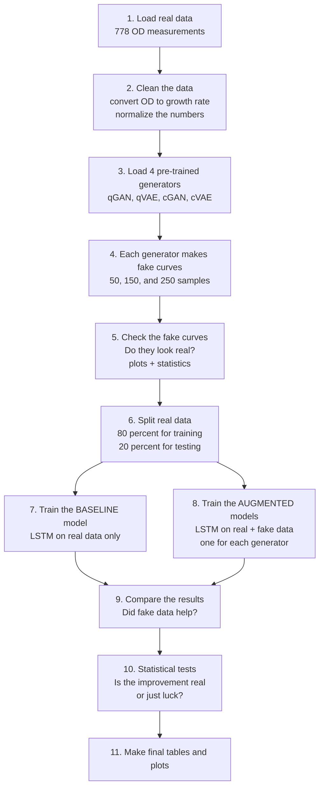

# HQSS Project — Simple Overview

*A plain-English guide to the project. No math. No jargon without a translation.*

---

## 1. The Big Picture

We want to **predict how microalgae grow**.

Microalgae are tiny plant-like organisms. We grow them in a tube. As they grow, the water becomes more cloudy. We measure the cloudiness. Cloudy water = more algae = more growth. This measurement is called **OD** (*optical density*).

Our problem is simple: **we only have 778 measurements**. That is not enough to train a good prediction model. It is like trying to learn English from one small book.

Our idea: **make fake data that looks real**, and add it to the real data. Then the model has more examples to learn from. Maybe it will predict better.

We use two kinds of tools to make the fake data:
- **Quantum models** — use tiny quantum circuits (a new kind of computer).
- **Classical models** — use normal neural networks.

The big question: **does fake data actually help the prediction?** And: **do quantum models help more than classical ones?**

---

## 2. The Four "Chefs"

Think of four different chefs. Each chef tries to bake a cake (a fake growth curve) that looks like a real one. We want to know which chef is the best.

| Name   | Type      | What it does                                    |
|--------|-----------|-------------------------------------------------|
| qGAN   | Quantum   | Makes fake growth curves using a quantum circuit |
| qVAE   | Quantum   | Another quantum method to make fake curves      |
| cGAN   | Classical | Same idea, but a normal neural network          |
| cVAE   | Classical | Same idea, but a normal neural network          |

---

## 3. What the Notebook Does — Step by Step

**Quick word list:**
- **LSTM** = a neural network good at time series (data that changes over time).
- **Baseline** = the control. The model trained only on real data. We compare everything to this.
- **Augmented** = real data + fake data mixed together.
- **MSE** = mean squared error. A number that tells us how wrong the model is. Smaller is better.

---

## 4. The End Goal

- **The question:** Does fake data from our generators help predict algae growth better than using real data alone?
- **Success:** The augmented model has lower error (lower MSE) than the baseline. And the improvement is statistically real, not random luck.
- **Bonus:** If the quantum generators beat the classical ones, this is a hint that quantum computers may be useful for biology problems like this.

---

## 5. Current Results (Short Version)

| Model | Result vs. Baseline | Meaning      |
|-------|---------------------|--------------|
| qGAN  | about 2–4% better   | Small help   |
| cVAE  | about 3–5% better   | Small help   |
| cGAN  | about 10–20% worse  | Hurts        |
| qVAE  | about 30–40% worse  | Hurts badly  |

**Plain takeaway:** two models help a little, two models hurt a lot.

**But we do NOT trust these numbers yet.** The experiment has bugs.

---

## 6. Why the Results Are Not Good

There are five main reasons. Each one is simple.

1. **qGAN noise bug.** During training we used one kind of random noise. During generation we used a different kind. This is like teaching a student in English and then testing in French.

2. **qGAN scaling bug.** By mistake, we shrink the fake curves to one tenth of their real size. The curves are too flat.

3. **Data leakage (the model "cheats").** The generators saw the test data during their own training. Any improvement may be unfair. It is like a student who sees the exam before the test.

4. **Unfair training time.** The baseline model trains for about 470 steps. The augmented model trains for about 150,000 steps. Of course it looks better — it had much more practice.

5. **Weak baseline.** The baseline runs only one time. The augmented models run three times and we take the average. It is like comparing one student's test score to the average of a whole class.

---

## 7. How We Can Improve

Five clear fixes:

1. **Fix the noise.** Use the same kind of random noise everywhere.
2. **Fix the scaling.** Remove the accidental 1/10 shrink from the fake curves.
3. **Split data first.** Train the generators only on the 80% training data. Never touch the test data.
4. **Equal training time.** Give the baseline and the augmented models the same number of training steps.
5. **More repeats.** Run every experiment 10 times, not 3. Then the average is trustworthy.

---

## 8. One Takeaway

> Our job is to answer **one simple question**: does fake data help the model predict real algae growth?
>
> Right now the experiment has bugs, so we cannot answer yet.
>
> **Fixing the bugs is the main work ahead.**
